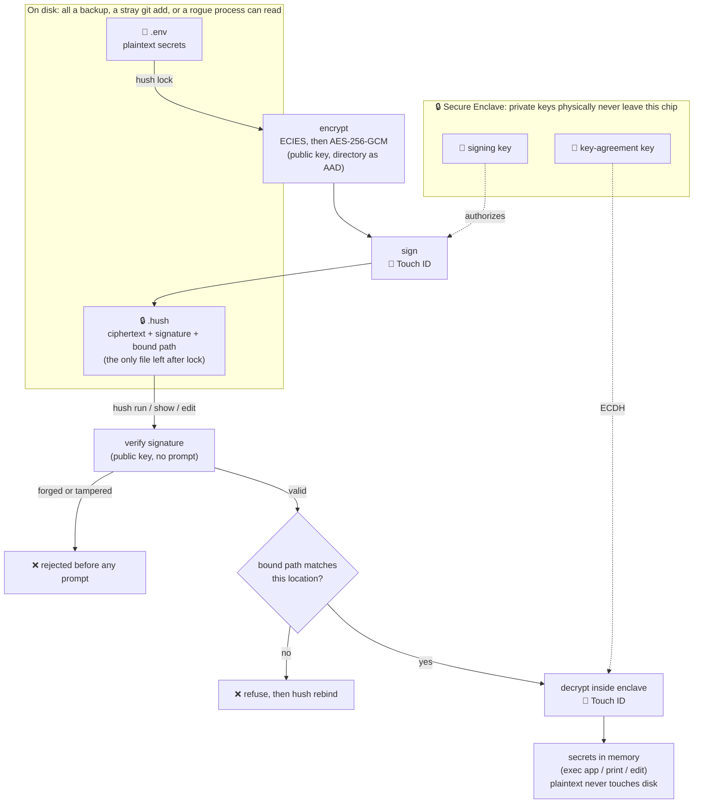
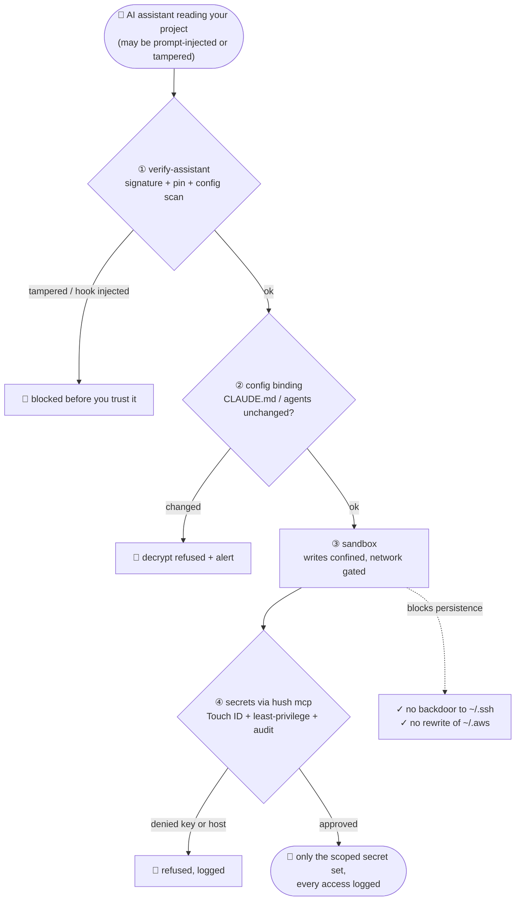

```
▐▄▄▌ ▐▄▄▌▐▄▄▌ ▐▄▄▌ ▐▄▄▄▄▄▄▌▐▄▄▌ ▐▄▄▌
▐██▌ ▐██▌▐██▌ ▐██▌▐██▌     ▐██▌ ▐██▌
▐███████▌▐██▌ ▐██▌ ▐█████▌ ▐███████▌
▐▀▀▌ ▐▀▀▌▐▀▀▌ ▐▀▀      ▐▀▀▌▐▀▀▌ ▐▀▀▌
▐▄▄▌ ▐▄▄▌ ▐▄▄▄▄▄▌ ▐▄▄▄▄▄▄▌ ▐▄▄▌ ▐▄▄▌
```

# Hush 🤫

[](https://github.com/miradorlabs/hush/actions/workflows/ci.yml)
&nbsp;Apache-2.0 · zero dependencies · macOS Secure Enclave

`.env` files sealed to your Mac's Secure Enclave. Secrets are encrypted into a
`.hush` file, and reading them back, to run your app, print a value, or edit —
always triggers the native macOS Touch ID / password prompt. `cat .hush`, a
leaked backup, a stray `git add`, or a rogue script reading your home directory
gets ciphertext only.

## How it works



Seal once (encrypt, then sign); every read is verified and gated by the enclave
before a single byte is decrypted. The details:

- `hush init` generates **two P-256 keys inside the Secure Enclave**: one for
  key agreement (decryption), one for signing (authenticity) — both with
  `userPresence` access control baked in. The private keys physically cannot
  leave the chip; what's stored in `~/.hush/identity.json` is an opaque blob
  only *this Mac's* enclave can use, useless if exfiltrated.
- `hush lock` encrypts with the **public** agreement key (ECIES: ephemeral
  P-256 ECDH → HKDF-SHA256 → AES-256-GCM), then **signs** the result with the
  enclave signing key — so the lock prompts once for your fingerprint.
- Any decryption requires a key-agreement operation inside the enclave, and the
  enclave refuses until macOS verifies user presence — Touch ID, Apple Watch,
  or your account password. There is no CLI flag, no env var, no file
  permission trick that bypasses it.
- Before any decrypt prompt, hush **verifies the signature** with the public
  key (no auth needed). A file that wasn't signed by this Mac's enclave — a
  forgery, a tampered ciphertext, or a stripped signature — is rejected
  outright and never reaches the prompt. Because *authoring* a valid file
  requires your fingerprint, malware that can read your public key still can't
  hand you secrets you'll trust.
- Every `.hush` file is **bound to the directory it was locked in**. The bound
  path is stored in the header for transparency, and it is mixed into both the
  AES-GCM additional authenticated data and the signature — so hush refuses to
  decrypt a copy that's been moved, and editing the header to fake the location
  fails cryptographically. The auth prompt always names the bound path, and for
  `hush run`, the exact command being launched — read it before you touch the
  sensor.

## Install

```sh
make install          # builds + ad-hoc signs + installs to ~/.local/bin
```

Or via Homebrew once a release is tagged (see `Formula/hush.rb`):

```sh
brew install miradorlabs/tap/hush    # after publishing to a tap
# or, from a checkout:
brew install --build-from-source ./Formula/hush.rb
```

## Develop & test

```sh
make test             # unit + exploit + fuzz tests (no Touch ID needed — 90+ cases)
make exploit          # drive the real binary through attacks it must refuse
make demo             # installs, then runs the non-interactive walkthrough
```

`make test` covers the logic that doesn't need the Secure Enclave: dotenv
parsing, sealed-file serialization, the ECIES + AES-GCM round trip and its
location-binding/signature guarantees (via a software stand-in key), decoy
generation, the package-manager and MITM-on-delivery guards, fingerprinting,
and secret scrubbing — plus seeded fuzz tests that throw thousands of random
inputs at the two parsers (dotenv and `.hush`), the only paths that ingest
untrusted data.

### Exploit tests

Each defense has an adversarial regression test that plays the attacker and
asserts the attack is refused — so a future change that weakens a guarantee
fails the build. Two layers:

- **`Tests/hushTests/ExploitTests.swift`** (in `make test`) — unit-level
  attacks: at-rest read yields only ciphertext, the
  substitution forgery (knowing the public key isn't enough), signature-strip
  downgrade, ciphertext tamper, exfil-by-relocation, header-forge to fake the
  location, supply-chain install scrape, wrapper/PATH interposition, key-swap
  fingerprint detection, decoy-has-no-real-secret, and alert-can't-leak-the-secret.
- **`tests/exploits.sh`** (`make exploit`) — drives the installed `hush` binary
  through the attacks that fail *before* any prompt: a forged/stripped/relocated
  `.hush` planted in a project, a blocked `npm install`, and `PATH`/`./wrapper`
  interposition. All must exit non-zero for the documented reason.

The auth-gated paths (`lock`/`run`) are exercised by hand through
`examples/web-app` — see its README.

## Trust & security

- **[`THREATMODEL.md`](THREATMODEL.md)** — what hush protects, the cryptographic
  construction, and the explicit non-goals, each tied to a test.
- **[`SECURITY.md`](SECURITY.md)** — how to report a vulnerability, and scope.
- **[`RELEASING.md`](RELEASING.md)** — reproducible builds, Developer ID signing,
  notarization, and checksums, so a published binary can be verified against
  source.
- **Zero third-party dependencies** (CI-enforced) — only Apple frameworks, so
  there's no transitive supply chain to compromise.
- **Standard primitives** — Apple CryptoKit (P-256 / HKDF-SHA256 / AES-256-GCM),
  not hand-rolled crypto. The bespoke composition is documented in the threat
  model for review.

## Usage

```sh
hush init                     # one-time per Mac
cd my-web-app
hush lock --rm                # prompt → .env → signed .hush, shred the plaintext

hush run -- npm run dev       # prompt → secrets injected as env vars → app runs
hush show                     # prompt → print all secrets
hush show DATABASE_URL        # prompt → print one value
hush edit                     # prompt → $EDITOR → re-encrypted on save
hush unlock                   # prompt → write plaintext .env back (escape hatch)
hush rebind                   # prompt → re-authorize after moving a project
hush reconfig                 # prompt → re-authorize AI-tool config after a change
hush decoy                    # write a fake .env wired to canary tokens
hush log                      # show the access log (every decrypt attempt)
hush doctor                   # audit: leftover plaintext, git leaks, exposure
hush mcp                      # run the secrets gateway as an MCP (stdio) server
hush run --sandbox -- cmd     # run a tool confined from ~/.ssh, ~/.aws, persistence
hush verify-assistant --all   # check your AI tools' signatures + config for tampering
```

Least-privilege and supply-chain guards on `run`:

```sh
hush run --only DB_URL -- node server.js   # inject just one var, not the whole set
hush run -- npm install                    # BLOCKED — install scripts can scrape env
hush run --allow-pkg -- npm install        # override if you really mean it
```

Moved a project? `hush` will refuse to decrypt at the new path until you run
`hush rebind` there — the prompt for that explicitly shows
`MOVE secrets bound to <old> → <new>` so a quiet relocation can't masquerade
as normal use.

`hush run` parses the decrypted dotenv content in memory, merges it into the
environment, and `exec`s your command — the plaintext never touches disk.

For multiple environments: `hush lock .env.production` produces
`.env.production.hush`, then `hush run -f .env.production.hush -- ...`.

## Secrets gateway (MCP)

`hush mcp` runs a secrets gateway as an [MCP](https://modelcontextprotocol.io)
stdio server. Instead of your AI tool reading `.env` (or `.hush`) off disk, it
requests secrets through tools, and every request runs the full hush check path
(location + signature + config binding) plus a Touch ID prompt that names the
caller and the key. Point your tool's MCP config at it, with the project as the
working directory:

```jsonc
// e.g. .mcp.json / Claude Code / Cursor MCP config
{
  "mcpServers": {
    "hush": { "command": "hush", "args": ["mcp", "--project", "/abs/path/to/project"] }
  }
}
```

Tools it exposes:

- `list_secrets` — the key *names* only, never values.
- `get_secret(name)` — one value, Touch ID + audited, subject to policy.
- `http_request(url, headers, body)` — header/body may contain `{{secret:NAME}}`
  placeholders that hush fills in **server-side** for the request, so the value
  is used without ever entering the model's context. Only hosts you allowlist
  are permitted.

Least-privilege via a project-local `.hushmcp.json` (an agent that only needs
the database never gets your AWS keys):

```json
{
  "allow": ["DATABASE_URL", "DB_*"],
  "deny":  ["AWS_*", "STRIPE_*"],
  "http_allow_hosts": ["api.stripe.com", "*.internal.example"]
}
```

**Honest scope.** Once `get_secret` returns a value, the (possibly compromised)
assistant holds it — the gateway does not make exfiltration impossible. What it
gives you is per-access **consent you can see** (the Touch ID prompt names the
key), a complete **audit trail** (`hush log`), **least-privilege** scoping so a
compromised agent can't grab the whole set, and the `http_request` path where a
secret is *used* for a call but never enters the model context and can only go to
a host you pre-approved. It is consent + detection + blast-radius reduction, in
the same spirit as the rest of hush — not a claim that a hijacked assistant can
never leak a secret.

Steer your assistant to use it (and never read `.env` directly) from your
`CLAUDE.md` / agent config — and bind that config with `hush lock --bind-config`
so the instruction itself can't be quietly rewritten.

## Containing a compromised assistant

For when the thing reading your project might be hostile (a prompt-injected agent,
a tampered tool, a malicious dependency). None of these is a silver bullet; each
removes one link from the kill chain, and they stack:



Each box below is one of those layers; the crypto + Secure Enclave underneath
mean the secrets are never readable at rest regardless.

### Sandboxed execution (`hush run --sandbox`)

Run the command inside a macOS Seatbelt profile so that even with secrets in hand
it can't write a persistent backdoor or move laterally:

```sh
hush run --sandbox -- npx @anthropic-ai/claude-code   # guard: blocks writes to
                                                       # ~/.ssh, ~/.aws, ~/.kube,
                                                       # ~/.gnupg, LaunchAgents, …
hush run --sandbox=strict -- node agent.js            # deny-default: only the
                                                       # project + temp are writable
hush run --sandbox=strict --no-network -- ./tool      # also gate the network
hush run --sandbox=strict --sandbox-allow ~/.cache/x -- ./tool   # widen the allowlist
```

- **`--sandbox` (guard):** allow-by-default, but deny writes to the persistence /
  lateral-movement set (`~/.ssh`, `~/.aws`, `~/.kube`, `~/.gnupg`, `~/.docker`,
  LaunchAgents, shell rc files, `~/.hush`). Won't break a normal tool.
- **`--sandbox=strict`:** deny-by-default writes; only the project, temp, and tool
  caches are writable. Tighter, may need `--sandbox-allow PATH` for some tools.
- **`--no-network`** gates the network for the run.

Honest scope: this is **write-containment** (plus optional network gating), not an
unescapable jail. `sandbox-exec` is deprecated-but-present in macOS, a kernel
escape would defeat it, and it doesn't stop the process *reading* what it can
reach or exfiltrating over an allowed network. It removes the persistence /
lateral-movement half of an attack — the half the crypto and the gateway don't
cover. The sandboxed process can still reach secrets through `hush mcp` (a normal
child it spawns), so it isn't crippled.

### Verify the assistant before you trust it (`hush verify-assistant`)

Supply-chain check on the tools you let read your project:

```sh
hush verify-assistant --all          # check every known assistant installed
hush verify-assistant cursor         # one by name
hush init --verify-assistants        # pin the current state as a baseline at init
```

For signed apps it runs `codesign` + Gatekeeper and pins the signer identity
(Team ID + leaf authority) **trust-on-first-use**; for JS CLIs (Claude Code,
Copilot) it pins a content hash of the entrypoint. A later swap to a different
signer, an unsigned build, or a changed CLI is flagged. It also scans your shell
and AI-tool config for injection red flags (`PYTHONSTARTUP`, `NODE_OPTIONS
--require`, `curl | sh`, a hook spawning a raw shell, …). Honest scope: there is
no authoritative remote manifest to diff against, so "known-good" is what you
pinned on a machine you trust; a root attacker who rewrites both the tool and the
pin (`~/.hush/assistants.json`) defeats it. Re-pin a deliberate update with
`--repin`.

### Compartmentalize by assistant (least privilege)

Give each agent only the credentials it needs, so one compromise isn't all of
them:

```sh
hush lock .env.backend          # → .env.backend.hush (DATABASE_URL, DB_PASSWORD)
hush lock .env.infra            # → .env.infra.hush   (AWS_*, only)

hush run -f .env.backend -- npm run db:migrate     # bare name resolves to .hush
hush run -f .env.infra -- terraform apply
```

`hush run -f .env.backend` resolves to the `.env.backend.hush` that
`hush lock .env.backend` produced, and the access log records exactly which
secret set each command used (e.g. `run "terraform apply" from .env.infra.hush
[sandbox:strict] with secrets`), so a compromise of the backend agent never had
the AWS keys in reach.

### Stacking them

```sh
hush run --sandbox=strict -f .env.backend -- npx @anthropic-ai/claude-code
```
verified binary (out-of-band) → config bound (`--bind-config`) → only the backend
secret set, fetched through `hush mcp` with Touch ID + audit → confined writes →
every access logged. Each layer is detection or containment, not prevention; the
point is that no single compromise silently gets everything.

## What this protects against — and what it doesn't

Protects: plaintext secrets at rest. Accidental commits, cloud backups, other
apps or scripts scanning your disk, copy-paste of project folders, stolen
laptop (enclave key is unusable without your login).

Does not protect: a running app's memory or environment (your process
legitimately has the secrets once you approve), or an attacker who can sit and
wait for you to approve a prompt. It turns "silently readable file" into
"explicit, visible approval per access."

### Known limitations — the particular issues to keep in mind

These are the seams hush can *narrow* but not fully *close*. They're called out
so you're not surprised:

- **Approval-riding (confused deputy).** hush authorizes the *file*, not the
  *caller*. Malware can invoke `hush show` and hope you reflexively approve the
  prompt. hush surfaces the requesting parent process (`requested by zsh
  [pid …]`) and the exact command/path so an unexpected request is visible — but
  the last line of defense is reading the prompt before you authenticate.
- **Key-pin tampering by same-user malware.** The Keychain fingerprint pin
  catches a swapped public key in `identity.json`, but an attacker who *also*
  rewrites the Keychain item defeats it. It's tamper-evident, not tamper-proof.
- **The running app itself.** Once you approve, the secrets are in your process's
  memory and environment; same-user code can read them, and the app can leak
  them to logs or a crash reporter. `--watch` catches output leaks and `--only`
  shrinks the blast radius, but silent in-memory reads or network exfiltration
  have no local signal — the decoy/canary is the tripwire for that.
- **Plaintext that already escaped** (old commits, backups, APFS snapshots) and
  a **persistent root compromise** are out of scope for any userland tool —
  rotation is the answer to the first, and nothing survives the second.

## Hardening

- `hush doctor` finds the leaks *around* the crypto: leftover plaintext files,
  `.env` in git history or currently tracked, missing gitignore coverage,
  sealed files whose location binding doesn't match where they sit, and a
  tamperable install. Run it in any project you migrate. If plaintext ever
  existed, rotating those secrets is the only complete fix — old copies may
  live in backups and APFS snapshots forever.
- The binary is signed with the hardened runtime (`-o runtime`), which blocks
  `DYLD_INSERT_LIBRARIES`-style code injection into hush itself.
- `hush init --biometry-only` uses `.biometryCurrentSet`: only a
  currently-enrolled fingerprint can approve a decrypt — a keylogged account
  password is useless, and changing fingerprint enrollment invalidates the key.
  Trade-off: a broken sensor or clamshell-mode external keyboard means you
  cannot decrypt at all; keep `hush unlock`'d copies of anything irreplaceable.
- **Sealed files are signed**, so confidentiality comes with authenticity: an
  attacker who reads your public key still can't forge a `.hush` you'll trust,
  because signing requires your enclave key (and thus your fingerprint). This
  closes the "substitution" attack where malware swaps in secrets pointing at
  attacker-controlled infrastructure.
- **`hush edit` works in a private 0700 temp directory** that's overwritten and
  removed on exit — including any swap/backup files your editor drops next to
  the file (`.swp`, `~`, `#...#`), so plaintext fragments don't linger in
  shared `/tmp`. Note the overwrite is best-effort: on SSDs it does *not*
  guarantee the old bytes are unrecoverable (wear-leveling / APFS
  copy-on-write). FileVault and secret rotation are what you actually lean on.
- **Config File Integrity Binding** (opt-in, `hush lock --bind-config`): AI coding
  tools are steered by in-repo config (`CLAUDE.md`, `.claude/agents`, `.cursor`
  rules, `.vscode/tasks.json`, Copilot instructions). A prompt-injection or a
  malicious commit that rewrites one of these can turn your own assistant into
  the exfiltrator: it reads `.env` (which it is allowed to) and ships it out. The
  injected instruction just lives in a file you trust rather than in the agent's
  input. With
  `--bind-config`, hush fingerprints that config surface and binds the
  fingerprint into the sealed file, signed by the Secure Enclave so it cannot be
  edited to match a tampered config. Every later decrypt recomputes it before the
  Touch ID prompt and refuses, with an alert, if anything changed since the seal.
  Re-authorize a change you made on purpose with `hush reconfig` (Touch ID), and
  `hush doctor` reports the binding status. It is detection, not prevention: it
  cannot stop config you approve, but it closes the *silent* swap that would
  otherwise ride your next approved decrypt unnoticed. Opt-in by design, because
  config like `.vscode/settings.json` changes often and a check that fired on
  every benign edit would just train you to bypass it.
- **Honeytoken decoy** (`hush lock --decoy`, `hush decoy`): leaves a believable
  fake `.env` where the real one was. A common class of attack
  is "prompt-inject an agent → it reads `.env` → exfiltrates it"; the npm/MCP
  supply-chain scanners do the same from post-install scripts. A decoy turns
  that read into a **tripwire** — wire its values to canary tokens
  (`--dns`/`--url`/`--aws`, free at canarytokens.org) and their use or DNS
  resolution alerts you that an exfiltration happened.
- **Least-privilege injection** (`hush run --only K1,K2`): hand a process only
  the secrets it needs, so a compromised dependency in that process tree can't
  scrape the whole set.
- **Package-manager guard**: `hush run -- npm/pip/... install` is refused by
  default, because install scripts run untrusted code with every injected env
  var in reach (the Shai-Hulud worm and the 2026 npm dependency-confusion
  campaigns harvest exactly this way). Run installs without hush, or with
  `--ignore-scripts`; override with `--allow-pkg`.
- **Access log** (`hush log`, at `~/.hush/access.log`): every decrypt attempt —
  approved, denied, forged, or guard-blocked — is recorded with a timestamp,
  the command, and the directory. The Touch ID prompt prevents; the log detects
  an access you didn't initiate. Secret *values* are scrubbed from every log
  line and alert, so the telemetry can't itself become a leak.
- **Exposure alerting**: the residual risk hush can't prevent is your *running*
  app leaking its own secrets (into logs, stack traces, console output). `hush
  run --watch` supervises the app and scans its stdout/stderr for the actual
  secret values; the moment one appears it raises an alert and logs an
  `EXPOSURE` event. `--redact` masks the value in-stream as well. A forged
  `.hush` or an access from the wrong directory alerts too. Alerts go to macOS
  Notification Center by default; set `HUSH_ALERT_WEBHOOK=<url>` for remote
  (e.g. Slack) alerting, or `HUSH_NOTIFY=off` to silence popups.
  Honest scope: `--watch` catches secrets that flow through the app's output —
  not an attacker silently reading the process environment and exfiltrating over
  the network. For that, the decoy/canary remains the tripwire.
- **`hush doctor` deploy checks**: flags `.env`/`.hush` sitting in web-served
  dirs (`public/`, `dist/`, `build/`, …), world-readable perms, and a
  `Dockerfile` whose `.dockerignore` doesn't exclude `.env` — the
  misconfigurations behind the mass `.env`-scanning campaigns (Bissa, the 2024
  cloud-extortion wave, the Next.js/Vercel incidents).
- **Man-in-the-middle on secret delivery**: `hush run` resolves the command to
  a vetted absolute path *before* decrypting — it refuses a relative/cwd-local
  command, a binary reached through a group/world-writable `PATH` directory, or
  one another user can overwrite, and execs that exact path (no second `PATH`
  lookup). This stops a malicious `./npm` or a writable-dir shim from receiving
  the secrets right after your approval. Override a known-safe case with
  `--allow-unsafe-path`.
- **Approval-riding (confused-deputy)**: the auth prompt and the log name the
  *parent process* that invoked hush (`requested by zsh [pid …]`), so a decrypt
  triggered by an editor, an agent, or a stray script — rather than your shell
  — is visible before you touch the sensor. Detectable, not preventable: no
  userland tool can attest the caller, so read the prompt.
- **MITM on your own key material**: `hush` pins a fingerprint of your public
  keys in the macOS Keychain (a separate store from `identity.json`) and
  verifies it on every load. A swapped public key — which would make your next
  `hush lock` encrypt to an attacker's key — changes the fingerprint and is
  refused with an alert. `hush fingerprint` shows it; `--repin` accepts a change
  you made on purpose. (Tamper-evident, not tamper-proof: a same-user attacker
  who also rewrites the Keychain item defeats it — but a file-only swap is
  caught.)
- **Verifiable identity for future sharing**: that same `hush fingerprint` is
  the primitive a team feature would build on — teammates compare fingerprints
  out-of-band (like an SSH key fingerprint or a Signal safety number) before
  trusting each other's keys, which is what defeats a MITM on a key *exchange*.
  Sharing itself (encrypting a file to multiple recipients) isn't built yet;
  the verifiable-identity foundation is.
- Against user-level malware replacing the binary:
  `sudo make install PREFIX=/usr/local && sudo chown root:wheel /usr/local/bin/hush`.
- Not fixable by hush or any userland tool: a persistent root compromise, your
  app itself leaking its environment (logs, crash reporters), secrets that
  already escaped in plaintext, or secrets read out of your *running* app's
  memory/environment after you approve — rotation and least-privilege are the
  answers there.

## Notes

- `.hush` files are machine-bound. Teammates each run `hush init` and lock
  their own copy; the encrypted file is safe to commit but only useful to the
  Mac that sealed it.
- Re-running `hush init` after deleting `~/.hush/identity.json` makes all
  existing `.hush` files permanently unreadable — `hush unlock` first.
- Each decrypt = one prompt; `lock` prompts once (to sign); `edit` prompts
  twice (decrypt to open, sign to save). macOS may satisfy `userPresence` with
  Apple Watch approval if you have that enabled.
- A v1 identity created before signing existed is upgraded automatically on
  next use (a signing key is added — no auth needed for that), after which
  locking begins to prompt. Note that current hush rejects any *unsigned*
  `.hush` at every read path — including `hush unlock` — so an unsigned file
  left over from a pre-release build can't be migrated in place; re-create it
  from the original `.env` with `hush lock`. (0.1.0 is the first release, so
  this only affects local pre-release artifacts.)
